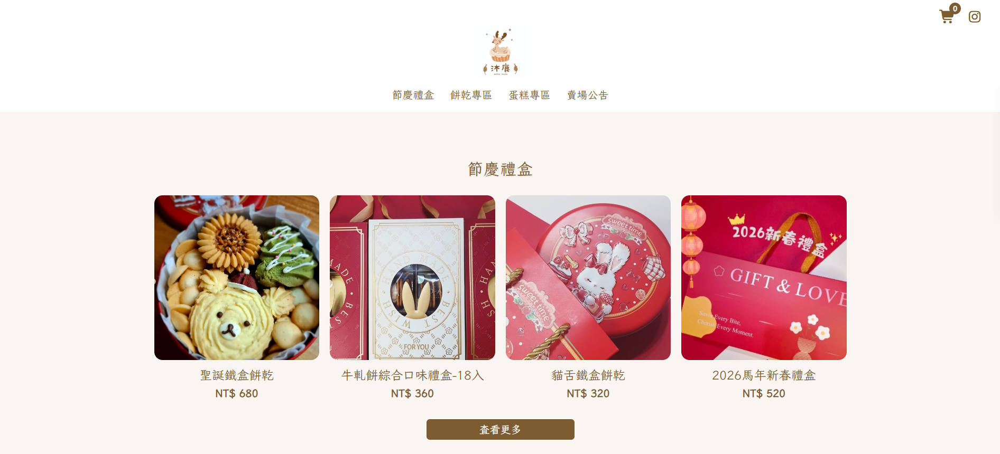
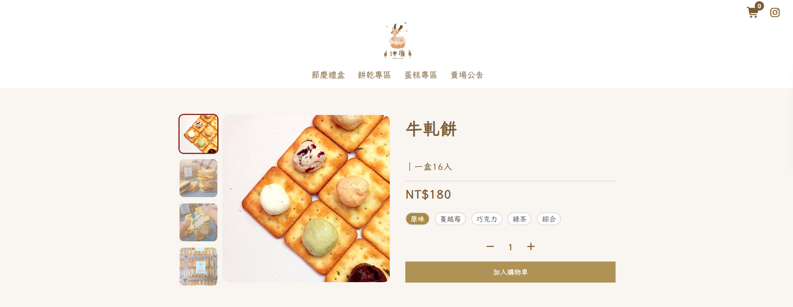
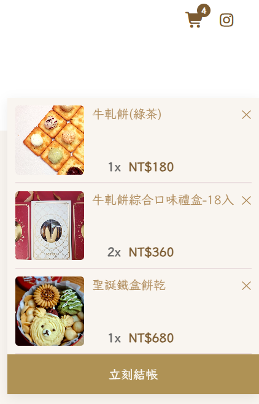
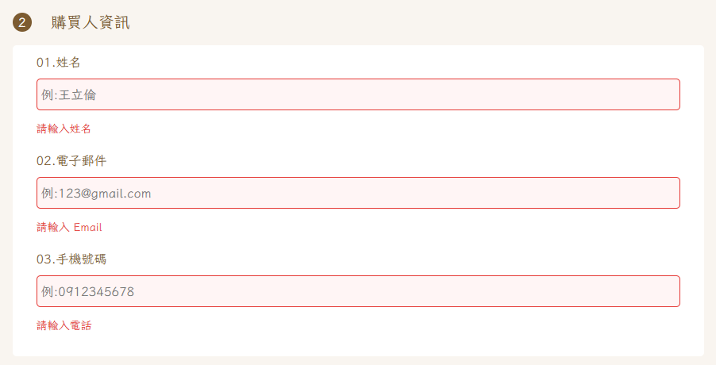
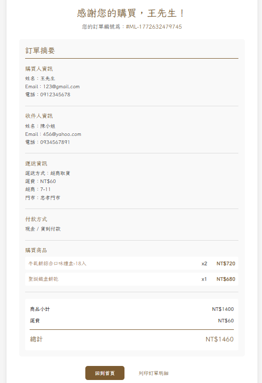
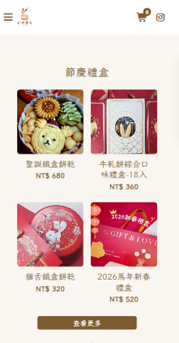
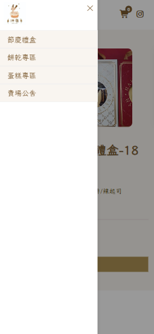

# 甜點網站 Dessert Shop

一個使用 **React + Vite** 開發的甜點電商網站，提供商品瀏覽、加入購物車、結帳流程與訂單確認功能。

此專案作為前端作品集，展示 React Component 設計、Context 狀態管理與完整購物流程實作。

---

## 🔗 Demo

🟢 [立即查看 DEMO](https://gpyuan.github.io/dessert-shop/)

---

## 截圖

## Home 商品列表



## 商品詳細頁



## 側邊購物車



## 結帳頁

.png>)
.png>)

## 錯誤訊息



## 確認頁



## 手機畫面

|                手機版首頁                |                  手機版選單                  |
| :--------------------------------------: | :------------------------------------------: |
|  |  |

---

## 技術棧

- **React** (Vite 建立)
- **React Router** (SPA 路由管理)
- **Context API (狀態管理)**
- **CSS / Flexbox / Grid** (響應式設計)
- **LocalStorage** (購物車本地儲存)

---

## Features

### 商品瀏覽

- 商品列表展示
- 商品詳細頁
- 多種口味選擇

### 購物車功能

- 加入購物車
- 調整商品數量
- 移除商品
- LocalStorage 保存購物車

### 結帳流程

- 購買人資訊填寫
- 收件人資訊
- 運送方式選擇
  - 門市自取
  - 宅配到府
  - 超商取貨
- 付款方式選擇

### 表單驗證

- Email 格式驗證
- 手機號碼驗證
- 必填欄位檢查
- 錯誤自動 scroll 到對應欄位

### 訂單完成頁

- 自動生成訂單編號
- 顯示購買商品清單
- 顯示訂單金額

---

```md
## 關鍵技術

### 購物車本地儲存

購物車資料透過 `localStorage` 保存，使用者重新整理頁面仍能保留商品。

### Context 狀態管理

使用 React Context 管理：

- Cart 狀態
- Checkout 表單
- 金額計算

避免 props drilling 並讓元件結構更清楚。

### 表單驗證

結帳頁實作完整表單驗證：

- 即時欄位驗證
- submit 時全表單檢查
- 透過`useRef`自動 scroll 到錯誤欄位
- 送出訂單時，透過資料比對將門市 ID 轉換為門市名稱，並產出獨立的訂單快照。

---

## 專案結構
```

src
├─ components
│ ├─ FlavorSelector
│ ├─ Footer
│ └─ MiniCart
│ └─ Navbar
│ └─ ProductCard
│ └─ ProductDetail
│ └─ ProductSection
│ └─ Toast
│
├─ context
│ ├─ CartContext.jsx
│ └─ CheckoutContext.jsx
│ └─ ToastContext.jsx
│
├─ pages
│ ├─ Announcement
│ ├─ CategoryPage
│ ├─ Checkout
│ ├─ CheckoutConfirm
│ ├─ Home
│ ├─ Policy
│ └─ ProductDetail
│
├─ data
│ └─ products.js
│ └─ addressData.js
│ └─ storeData.js
│
└─ App.jsx

````

---

## 🚀 Installation

```bash
git clone https://github.com/gpyuan/dessert-shop.git
cd dessert-shop
npm install
npm run dev
````
